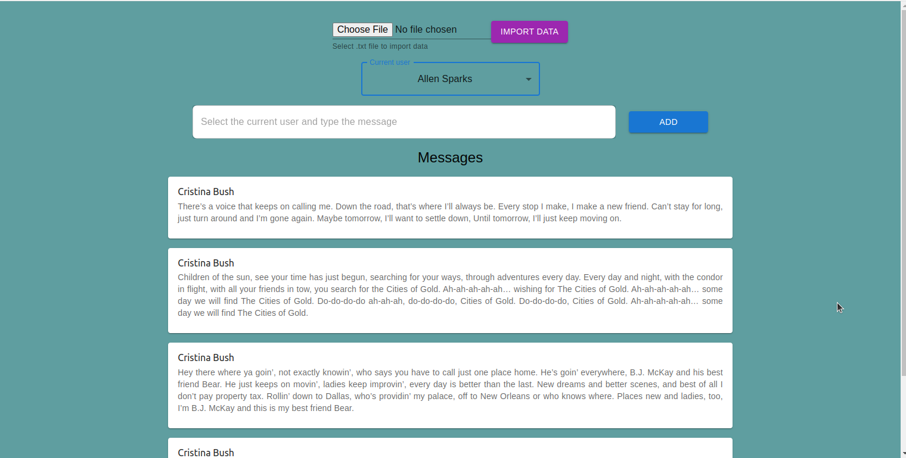

# code_challenge

[Demo](https://youtu.be/sMmv8UboWaE)



## How to install

### Backend part

```
npm i
create file .env
npm start
```

### Frontend part

```
npm i
npm start
```

---

## API Endpoints:

### GET /users

The list of the users with names and surnames

### POST /users

Create new user

### GET /users/:id

Find the user with messages and subscriptions

### POST /messages

Create the message

---

## Technologies

### BE: Node.js, Express.js, Mongo DB, Mongoose

### FE: HTML5, CSS3, JavaScript, React, Materila UI
